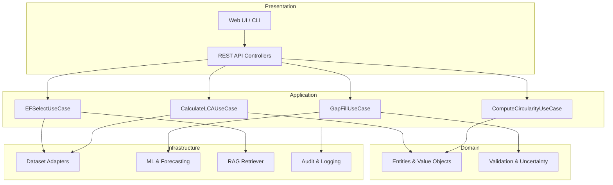
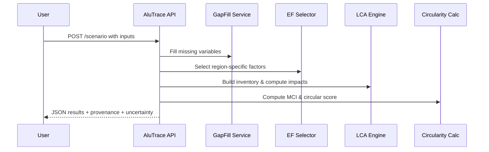

# AluTrace — AI‑Driven LCA and Circularity Platform for Metallurgy & Mining

Problem Statement: SIH 25069 • Organization: Ministry of Mines • Department: JNARDDC • Category: Software

Table of Contents
- [A. Title Block](#a-title-block)
- [B. Executive Summary](#b-executive-summary)
- [C. Problem Understanding and User Personas](#c-problem-understanding-and-user-personas)
- [D. Solution Overview and Differentiators](#d-solution-overview-and-differentiators)
- [E. System Architecture (Clean Architecture)](#e-system-architecture-clean-architecture)
- [F. AI and ML Components (with JSON I/O examples)](#f-ai-and-ml-components-with-json-io-examples)
- [G. Circularity Metrics + LCA Integration](#g-circularity-metrics--lca-integration)
- [H. Data Strategy and Governance](#h-data-strategy-and-governance)
- [I. Security, Compliance, and Transparency](#i-security-compliance-and-transparency)
- [J. UX and Demo Walkthrough](#j-ux-and-demo-walkthrough)
- [K. Hackathon Implementation Plan (48–72 hours)](#k-hackathon-implementation-plan-48-72-hours)
- [L. Success Metrics and Scoring Rubric Mapping](#l-success-metrics-and-scoring-rubric-mapping)
- [M. Risks and Mitigations](#m-risks-and-mitigations)
- [N. Roadmap (30 / 90 / 180 days)](#n-roadmap-30--90--180-days)
- [O. References](#o-references)
- [Assumptions & Open Questions](#assumptions--open-questions)

A. Title Block
- Project Name: AluTrace
- Tagline: AI‑first circularity + LCA intelligence for India’s metals sector
- Problem Statement: SIH 25069 — AI‑Driven Life Cycle Assessment Tool for Circularity and Sustainability in Metallurgy & Mining
- Stakeholders: Ministry of Mines, JNARDDC, Metallurgy & Mining firms, Sustainability teams, Policy makers
- Version: 1.0 (Hackathon submission) • Date: 2025‑09‑06

B. Executive Summary
AluTrace is an AI‑driven platform that makes Life Cycle Assessment fast, accessible, and circularity‑aware for the metals sector (starting with aluminium; copper‑ready). It combines AI gap‑filling, factor selection with provenance, circularity indicators (e.g., recycled content, EoL recycling rate, MCI/CI), and interactive what‑if analysis into one clean experience. The platform aligns with ISO 14040/44 principles, integrates India‑specific context (CEA, IBM, JNARDDC), and produces audit‑ready reports.

Proven impact targets
- 80% faster baseline LCA scenario creation (months → 1–2 weeks; hackathon demo: minutes)
- 85–95% data completeness via AI gap‑filling + EF retrieval with confidence bands
- 10–20% accuracy delta vs. references, with calibrated uncertainty intervals
- Real‑time overlays for grid carbon intensity and renewable share forecasts
- Auto provenance for factors, scenarios, and recommendations (RAG‑backed citations)

Hackathon demo: Upload a simple CSV or form inputs, run gap‑fill + EF selection, compute LCA and circularity metrics, visualize flows, compare 2 scenarios, export a short report.

C. Problem Understanding and User Personas
Key pain points
- Fragmented, incomplete plant data; inconsistent emission factors; limited India‑specific defaults
- LCA tools are expert‑centric and often exclude circularity metrics
- Slow scenario cycles; difficult trade‑off analysis (cost ↔ impacts ↔ circularity)
- Compliance pressure (ISO 14040/44, EPR, national disclosures)

Personas
- Metallurgist/Process Engineer: needs unit‑process sensitivity and quick what‑ifs
- Plant Manager/Operations Head: needs KPIs, bottlenecks, and cost/impact forecasts
- Sustainability Analyst: needs auditable reports with sources, uncertainty, and comparables
- Policy/Regulatory Analyst (JNARDDC): needs sector benchmarks and intervention levers

D. Solution Overview and Differentiators
What AluTrace does
- Ingests user inputs and data files; validates, gap‑fills, and selects context‑appropriate emission factors
- Computes both LCA impacts (GWP, energy, water, waste) and circularity metrics (recycled content, EoL rate, MCI/CI)
- Visualizes flows (Sankey‑style) and scenario comparisons; provides recommendations
- Generates audit‑ready reports with provenance and uncertainty

Why we’ll win (differentiators)
- Circularity‑first alongside LCA in one workflow (not post‑hoc)
- India‑aware defaults and factor provenance (CEA/IBM/IAI etc.) with RAG‑backed citations
- Transparent uncertainty policy with intervals + RAG fallback when confidence is low
- Clean Architecture for maintainability; modular services, clear DTOs; easy to extend beyond aluminium

E. System Architecture (Clean Architecture)
Layers (aligned with provided project rules: Domain → Application → Infrastructure → Presentation)
- Domain (pure business rules): Entities (ProcessUnit, MaterialFlow, ImpactResult, CircularityMetrics); Policies (Validation, Uncertainty)
- Application (use cases, orchestration): CalculateLCAUseCase, ComputeCircularityUseCase, GapFillUseCase, EFSelectUseCase; DTOs
- Infrastructure (adapters): Dataset connectors (CEA, IBM, OpenLCA exports), Model runners (ML registry), RAG retriever, Persistence, Audit
- Presentation (API/UI): REST controllers, minimal web UI for demo and report export

Mermaid: Architecture


F. AI and ML Components (with JSON I/O examples)
Components (initial set)
- Gap‑Filling Ensemble: predicts missing LCI parameters (energy, CO2, water, waste, transport)
- Emission Factor Selector: ranks/selects EF by process/region/tech/year; regress fallback; provenance & confidence
- Surrogates: fast what‑if for key unit processes (e.g., alumina refining, smelting, remelt)
- Forecasters: grid CO2 intensity and renewable mix (region‑specific)
- Anomaly & Rule Checks: mass/energy balance, range checks
- Optimizer: scenario recommendations (e.g., recycled content %, grid mix) subject to constraints
- Uncertainty Layer: ensemble variance, quantiles, conformal prediction; RAG invoked when confidence is low

Example: Gap‑fill API
```json path=null start=null
{
  "endpoint": "/api/v1/gapfill",
  "request": {
    "metal_type": "aluminium",
    "process_stage": "smelting",
    "region_iso": "IN",
    "year": 2025,
    "production_tonnes": 120000,
    "electricity_kwh_per_t": 14200,
    "recycled_content_pct": 35
  },
  "response": {
    "imputed": {
      "energy_use_gj_per_t": {"mean": 155.2, "p10": 146.0, "p90": 165.1},
      "co2_kg_per_kg": {"mean": 11.9, "p10": 10.8, "p90": 13.1}
    },
    "confidence": 0.82,
    "provenance": ["model:xgboost_stack", "baseline:industry_range"]
  }
}
```

Example: EF select API
```json path=null start=null
{
  "endpoint": "/api/v1/ef/select",
  "request": {"process": "electrolysis", "region": "IN", "year": 2025},
  "response": {
    "factor_gco2e_per_kwh": 780,
    "source": "CEA 2025 forecast",
    "confidence": 0.74,
    "citations": ["cea.nic.in"]
  }
}
```

Example: Circularity calculator
```json path=null start=null
{
  "endpoint": "/api/v1/circularity/calc",
  "request": {"mass_t": 1.0, "recycled_content": 0.35, "eol_recycling_rate": 0.7},
  "response": {
    "mci": 0.58,
    "circular_score": 68,
    "assumptions": ["closed_loop_fraction:0.4", "losses:5%"],
    "notes": ["MCI simplified for demo; full method in backlog"]
  }
}
```

G. Circularity Metrics + LCA Integration
- Recycled Content (RC) = recycled_mass / total_mass
- End‑of‑Life Recycling Rate (EoLR) = recovered_mass / end_of_life_mass
- Material Circularity Indicator (MCI) and/or Circularity Index (CI) — compute alongside LCA impacts
- Boundary clarity: cradle‑to‑gate by default for MVP; extend to cradle‑to‑cradle for circular cases
- Allocation & cut‑offs: documented assumptions per scenario; provenance recorded
- Output pairing: Each scenario returns both impact metrics (GWP, energy, water, waste) and circularity metrics side‑by‑side

Mermaid: Data Flow
```mermaid path=null start=null
flowchart LR
  A[User Inputs/CSV] --> B[Validation & Schema]
  B --> C[Gap‑Filling Ensemble]
  C --> D[EF Selector (RAG‑backed)]
  D --> E[LCA Inventory + Impacts]
  E --> F[Circularity Calculator]
  F --> G[Uncertainty & Monte Carlo]
  G --> H[Reports & API Responses]
  D --> I[Provenance Store]
  E --> I
  F --> I
```

H. Data Strategy and Governance
- Sources: CEA (grid factors & renewables), IBM (mineral stats), Ministry of Mines (reports), IAI/ICSG (industry), OpenLCA databases (ELCD/NEEDS), EPA USEEIO, literature (curated)
- Synthetic data for training + augmentation when needed; plant partnerships for real data (anonymized)
- Quality: schema validation, range & unit checks, cross‑source reconciliation, anomaly detection, manual review samples
- Governance: dataset versioning, provenance, model cards, audit logs, data dictionary; clear licensing boundaries

I. Security, Compliance, and Transparency
- PII stance: none; plant operational data only with consent and agreements
- Security practices: token‑protected APIs in demo, HTTPS in production, secrets via env/KeyVault, rate limiting, standardized error schema with correlation IDs
- Compliance: ISO 14040/44 alignment for LCA; ISO 27001‑style controls for production roadmapping
- Transparency: provenance for EFs & recommendations; uncertainty intervals attached to outputs; RAG citations when confidence is low

J. UX and Demo Walkthrough
Journeys
- Metallurgist: runs a smelting scenario with 35% recycled content; sees impact + circularity changes and sensitivities
- Plant Manager: compares baseline vs. high‑recycling line; sees KPI deltas, cost proxy, and recommendations
- Policy Analyst: queries state benchmark with forecasted grid intensity overlay; exports summary

Sequence (API path)


Demo artifacts
- Minimal web form or cURL examples
- 2 scenarios (baseline vs. circular) with side‑by‑side result table
- Sankey‑style flow (Mermaid/visual) and short narrative report export

K. Hackathon Implementation Plan (48–72 hours)
Day 1 — Core scaffolding & MVP endpoints
- Initialize repo; define DTOs; create basic FastAPI app; sample CSVs
- Implement validators; simple gap‑fill heuristics; minimal MCI calculator
- EF selector stub with India grid intensity defaults; static Sankey via Mermaid

Commands (PowerShell)
```bash path=null start=null
python -m venv .venv
. .\.venv\Scripts\Activate.ps1
pip install fastapi uvicorn pydantic pandas numpy scikit-learn statsmodels openpyxl
New-Item -Name "app" -ItemType Directory -Force | Out-Null
New-Item -Name "data" -ItemType Directory -Force | Out-Null
New-Item -Path "app\main.py" -ItemType File -Force | Out-Null
uvicorn app.main:app --reload
```

Day 2 — Intelligence & reporting
- Add RAG‑lite over a local docs folder (research & standards excerpts); attach sources
- Add uncertainty (quantile/ensemble) and a basic optimizer for recycled content vs. CO2
- Report generator (Markdown/CSV); provenance logging

Day 3 — Polish & demo
- UX polish; add 2–3 pre‑baked scenarios; finalize diagrams & docs
- Tests for core endpoints; small demo script; record optional walkthrough

Runbook (demo)
- Start: uvicorn app.main:app --reload
- Calls: GET /health; POST /api/v1/gapfill; POST /api/v1/ef/select; POST /api/v1/circularity/calc; POST /api/v1/scenario/report
- Data: use provided sample CSVs; outputs saved to data/exports

L. Success Metrics and Scoring Rubric Mapping
Judging criteria mapping
- Novelty: unified LCA + circularity with AI gap‑fill and RAG provenance
- Impact: faster LCAs, higher data completeness, actionable recommendations
- Feasibility: Clean Architecture, modular services, demo‑ready endpoints
- Usability: simple inputs, clear outputs, diagrams, and report
- Completeness: covers objectives, architecture, data, security, demo, KPIs

KPIs (hackathon demo targets)
- Baseline scenario in < 5 minutes end‑to‑end on sample data
- Data completeness 85–95% (imputed + provided) with uncertainty bands
- API p95 latency < 500 ms for core endpoints on sample inputs
- Export report with citations and confidence

M. Risks and Mitigations
- Data licensing constraints (ecoinvent, proprietary): use open proxies for demo; pluggable datasets; secure DSAs later
- Data quality gaps: explicit uncertainty + overrides; anomaly/rule checks
- Model generalization: conservative defaults; physics‑aware guardrails; baseline comparisons
- Time constraints: scope MVP to aluminium; pre‑baked scenarios; defer heavy UI to post‑hackathon

N. Roadmap (30 / 90 / 180 days)
- 30 days: Harden aluminium MVP; batch runs; EF catalog expansion; better validation & export templates
- 90 days: Add copper and critical minerals; improved forecasting/optimization; plant historian adapters; role‑based UI
- 180 days: Enterprise security; cloud/on‑prem deployment; certification workflows; benchmarking portal for JNARDDC

O. References
- SIH 25069 Problem Statement (Problem Statemt.txt)
- Research notes (research/research1.txt, research3.txt, research4.txt)
- Platform overview (README.md)
- AI/ML design (02_AI_ML_Implementation.md)
- Data strategy (Data_Acquisition_Guide.md)
- RAG approach (RAG_Implementation_Guide.md)
- Standards/Authorities: ISO 14040/44, CEA, IBM, IAI, ICSG, USEEIO/OpenLCA

Assumptions & Open Questions
- MVP scope: cradle‑to‑gate; MCI simplified; aluminium focus; Indian defaults
- Confirm acceptable default EF sources/years when region‑specific data absent
- Deployment target for pilot: local vs. cloud (Gov cloud/on‑prem?)
- Data sharing agreements for plant data and redistribution/licensing boundaries
- Preferred report format for stakeholders (PDF/Excel/JSON)

